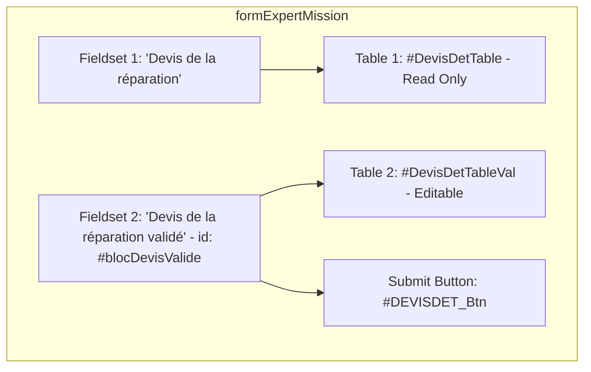
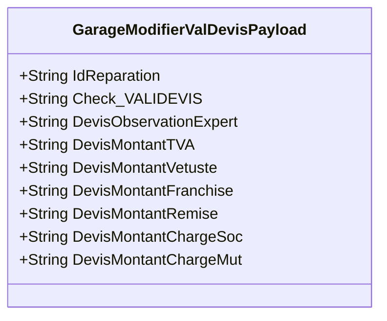
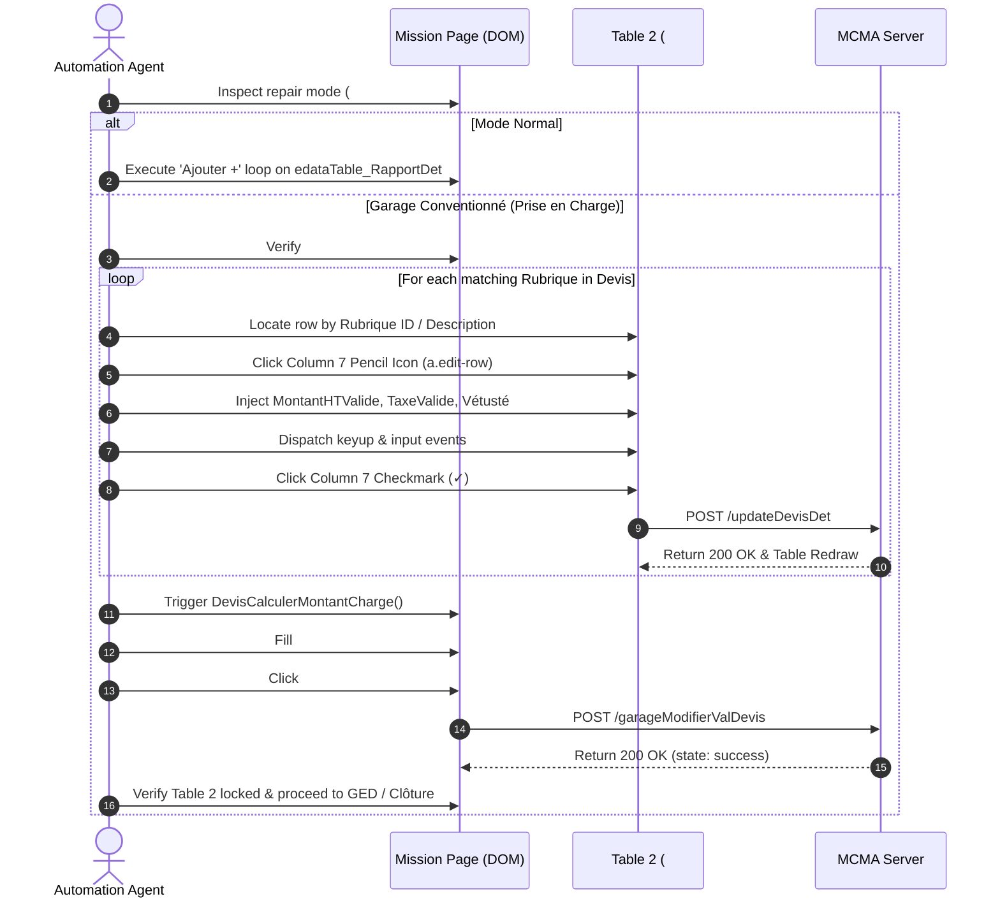
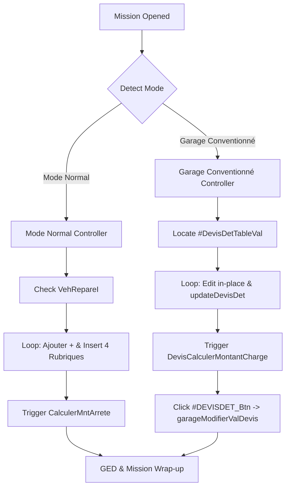

# Analysis: Dual-Table "Garage Conventionné" (PEC) Architecture & Execution Blueprint

---

## 1. DOM Architecture & Selector Analytics

### 1.1 Dual-Table Structural Differentiation
In "Garage Conventionné" mode, MCMA dynamically renders two distinct table components inside the mission DOM under two separate fieldset containers:

| Dimension | Table 1 (Garage Original Quote) | Table 2 (Expert Validated Quote) |
| :--- | :--- | :--- |
| **Parent Container** | `<fieldset>` (`legend: Devis de la réparation`) | `<fieldset id="blocDevisValide">` (`legend: Devis de la réparation validé`) |
| **Table ID** | `#DevisDetTable` | `#DevisDetTableVal` |
| **Wrapper Div ID** | `#DevisDetTable_wrapper` | `#DevisDetTableVal_wrapper` |
| **JavaScript Instance** | `edataTable_DevisDet` | `edataTable_DevisDetVal` |
| **Mutability** | Strictly Read-Only (All column editors: `disabled`) | Fully Editable (Row-level inline editing enabled) |
| **Column Count** | **4 Columns**: Rubrique, Montant HT, MT Taxe, Montant TTC | **8 Columns**: Rubrique, Montant HT, MT Taxe, Montant TTC, Taux Vétusté, MT Vétusté, Edit Action (col 7), Delete Action (col 8) |

---

### 1.2 Column Mapping for Table 2 (`#DevisDetTableVal`)

| Column Index | Field Name / Data Option | Editor Type | Role & Behavior |
| :---: | :--- | :--- | :--- |
| **1** | `IdRubrique` | `liste` (Dropdown) | Rubrique Category label |
| **2** | `MontantHTValide` | `money` (Input) | Editable Montant HT |
| **3** | `TaxeValide` | `money` (Input) | Editable TVA / Tax amount |
| **4** | `MontantTTCValide` | `disabled` (Computed) | Computed TTC (`MontantHTValide + TaxeValide`) |
| **5** | `TauxVetusteValide` | `money` (Input) | Percentage of depreciation (Vétusté %) |
| **6** | `MontantVetusteValide`| `money` (Input) | Amount of depreciation (MT Vétusté) |
| **7** | `edit` | Action Icon | Pencil icon (`a.edit-row` / `a#Modifier`) to enter edit mode; Green checkmark (`a i.fa-check`) to commit row |
| **8** | `delete` | Action Icon | Trash icon (`a.delete-row`) to remove row |

---

### 1.3 Target Input Selectors (Scoped Exclusively to Table 2)
To guarantee that the automation tool never touches Table 1 or other forms on the page, all selectors must be strictly scoped under `#blocDevisValide` or `#DevisDetTableVal`:

* **Row Edit Trigger (Pencil Icon)**:
  `#DevisDetTableVal tbody tr td a.edit-row`, `#DevisDetTableVal tbody tr td a#Modifier`, or `#DevisDetTableVal tbody tr:nth-child(N) td:nth-child(7) a`
* **Montant HT Input (Active Row)**:
  `#blocDevisValide #MontantHTValide` or `#DevisDetTableVal tr.editing input[id*='MontantHTValide']`
* **MT Taxe Input (Active Row)**:
  `#blocDevisValide #TaxeValide` or `#DevisDetTableVal tr.editing input[id*='TaxeValide']`
* **Taux Vétusté Input (Active Row)**:
  `#blocDevisValide #TauxVetusteValide` or `#DevisDetTableVal tr.editing input[id*='TauxVetusteValide']`
* **MT Vétusté Input (Active Row)**:
  `#blocDevisValide #MontantVetusteValide` or `#DevisDetTableVal tr.editing input[id*='MontantVetusteValide']`
* **Row Confirm Button (Green Checkmark ✓)**:
  `#DevisDetTableVal tbody tr.editing td:nth-child(7) a` or `#DevisDetTableVal tbody tr.editing td:nth-child(7) a:has(.fa-check)`

---

### 1.4 Submit Button Selector ("Valider Devis ✓")
Located immediately below Table 2 inside the `#blocDevisValide` container:
* **Primary ID Selector**: `#DEVISDET_Btn`
* **Scoped Tag Selector**: `a#DEVISDET_Btn`
* **Function-Bound Selector**: `a[onclick*='ValiderDevis()']`
* **Visual Anchor Selector**: `#blocDevisValide a.btn-success:has-text('Valider Devis')`

---

## 2. Network Payload Analytics (`garageModifierValDevis`)

### 2.1 HTTP Request Contract
* **HTTP Method**: `POST`
* **URL Endpoint**: `https://sinauto.mamda-mcma.ma/SinAuto_MCMA/expertise/gestiongarage/garageModifierValDevis`
* **Content-Type**: `application/x-www-form-urlencoded; charset=UTF-8`
* **Originating Context**: Triggered directly by `ValiderDevis()` upon clicking `#DEVISDET_Btn`.

---

### 2.2 Payload Schema & Field Specifications

| Field Name | Type | Required | Sample Value | Business Description |
| :--- | :---: | :---: | :--- | :--- |
| `IdReparation` | Numeric String | **Yes** | `"717751"` | Primary key identifier of the repair claim context |
| `Check_VALIDEVIS` | Flag (`"O"` / `"N"`) | **Yes** | `"O"` | Hardcoded confirmation flag signaling approval of the validated devis |
| `DevisObservationExpert` | String | No | `""` or Text | Free-text expert observations on the validated garage quote |
| `DevisMontantTVA` | Decimal String | **Yes** | `"600.01"` | Total TVA amount calculated from Table 2 footer |
| `DevisMontantVetuste` | Decimal String | **Yes** | `"0"` | Total depreciation amount across all validated line items |
| `DevisMontantFranchise` | Decimal String | **Yes** | `"180"` | Calculated deductible (Franchise) based on insurer rules |
| `DevisMontantRemise` | Decimal String | **Yes** | `"0"` | Commercial discount / rebate amount |
| `DevisMontantChargeSoc` | Decimal String | **Yes** | `"0"` | Amount charged to the insured (*Montant à charge du sociétaire*) |
| `DevisMontantChargeMut` | Decimal String | **Yes** | `"3600"` | Amount covered directly by the insurer (*Montant à charge de la mutuelle*) |

---

### 2.3 Post-Validation Response Handling
When `garageModifierValDevis` returns `{"state": "success", "message": "..."}`:
1. The `#DEVISDET_Btn` submit button is hidden (`$('#DEVISDET_Btn').hide()`).
2. All inputs inside `#blocDevisValide` are locked and disabled (`$('#blocDevisValide :input').prop('disabled', true)`).
3. The editable table instance is disabled (`edataTable_DevisDet.disable()`).

---

## 3. Event Listeners & Auto-Calculations

### 3.1 Row-Level Inline Calculations (`onBeginEdit`)
When a row is opened for editing via the pencil icon, MCMA dynamically binds native jQuery event listeners:

1. **TTC Automatic Summation**:
   * **Trigger**: `keyup` on `#MontantHTValide` OR `keyup` on `#TaxeValide`
   * **Formula**:
     $$\text{MontantTTCValide} = \text{MontantHTValide} + \text{TaxeValide}$$
2. **Vétusté Inter-Calculations**:
   * **Trigger**: `keyup` on `#MontantVetusteValide` $\rightarrow$ Executes `CalculerTauxVetusteValide()`:
     $$\text{TauxVetusteValide} = \left( \frac{\text{MontantVetusteValide}}{\text{MontantTTCValide}} \right) \times 100$$
   * **Trigger**: `keyup` on `#TauxVetusteValide` $\rightarrow$ Executes `CalculerMontantVetusteValide()`:
     $$\text{MontantVetusteValide} = \left( \frac{\text{MontantTTCValide}}{100} \right) \times \text{TauxVetusteValide}$$

---

### 3.2 Form-Level Financial Split Engine (`DevisCalculerMontantCharge`)
Triggered automatically whenever Table 2 rows are saved/updated, or when the `#DevisTvaRecupI` checkbox changes state:

* **1. Montant Arrêté Calculation**:
  * If TVA is Recoverable (`#DevisTvaRecupI` is checked):
    $$\text{Montant Arrêté} = \text{Montant TTC} - \text{Montant Vétusté} - \text{Montant TVA}$$
  * If TVA is Non-Recoverable:
    $$\text{Montant Arrêté} = \text{Montant TTC} - \text{Montant Vétusté}$$
* **2. Franchise Calculation**:
  $$\text{Franchise} = \frac{(\text{Montant Réparation} - \text{Vétusté} - \text{Remise}) \times \text{Taux Franchise}}{100}$$
* **3. Insured Share (*Charge Sociétaire*)**:
  $$\text{Charge Sociétaire} = \left(\text{Franchise} \times \frac{\text{Part Responsabilité}}{100}\right) + \text{Vétusté} \;[+\text{ TVA if TVA Récupérable}]$$
* **4. Insurer Share (*Charge Mutuelle / Prise en Charge*)**:
  $$\text{Charge Mutuelle} = \text{Montant Réparation} - \text{Charge Sociétaire} - \text{Remise}$$

---

### 3.3 Required Dispatch Sequence for Automation
To ensure all cascading formulas execute without data desynchronization, the automation agent must dispatch events in this strict order per row:
1. Focus target field $\rightarrow$ Set value $\rightarrow$ Dispatch `input` $\rightarrow$ Dispatch `keyup` $\rightarrow$ Dispatch `change`.
2. Confirm row via Column 7 checkmark $\rightarrow$ Await row persistence via `POST /updateDevisDet`.
3. Dispatch `change` on `#DevisTvaRecupI` and trigger `DevisCalculerMontantCharge()` to synchronize the summary financial block.

---

## 4. High-Level Implementation Plan

---

### 4.1 Step-by-Step Execution Sequence

#### Step 1: Dynamic Mode Detection & Workflow Branching
* Read the text value of `#modeReparation` or examine the search filter attribute `Modereparation`.
* **Branch Decision**:
  * If value contains `"CONVENTION"` or `"C"` $\rightarrow$ Divert execution to the **Garage Conventionné Workflow**.
  * If value contains `"NORMAL"` or `"N"` $\rightarrow$ Maintain the existing **Mode Normal Workflow** (`#VehRepareI` $\rightarrow$ `Ajouter +` on `#tableRapportDet`).

---

#### Step 2: Table 2 Row Discovery & In-Place Modification
* The agent does **NOT** click `Ajouter +`.
* Target the pre-populated rows inside `#DevisDetTableVal tbody tr`.
* For each validated rubrique line item derived from the active chiffrage:
  1. Find the corresponding row in Table 2 by matching the category description in Column 1 (`td:nth-child(1)`).
  2. Click the edit action link in Column 7: `#DevisDetTableVal tbody tr:nth-child(i) td:nth-child(7) a.edit-row`.
  3. Wait for the active row to transition into editing state (`tr.editing`).
  4. Inject the approved numbers into `#MontantHTValide`, `#TaxeValide`, and `#TauxVetusteValide` / `#MontantVetusteValide`.
  5. Dispatch `input`, `change`, and `keyup` to calculate `#MontantTTCValide` and depreciation.
  6. Click the Column 7 green checkmark (`✓`) on the editing row.
  7. Intercept and wait for `POST /SinAuto_MCMA/expertise/gestionexpert/updateDevisDet` (HTTP 200) to confirm row lock-in before moving to the next line.

---

#### Step 3: Financial Summary & Charge Split Synchronization
* Execute `DevisCalculerMontantCharge()` on the page.
* Verify that the summary block reflects:
  * `#DevisMontantTVA` matches total tax.
  * `#DevisMontantChargeMutuelle` matches the approved insurer coverage amount.
  * `#DevisMontantChargeSocietaire` matches the client share (Franchise + Vétusté).
* Inject expert notes into `#DevisObservationExpert` if present.

---

#### Step 4: Devis Validation Submission
* **Live Production Run**:
  * Click `#DEVISDET_Btn` (`Valider Devis ✓`).
  * Await the server response from `POST /garageModifierValDevis`.
  * Confirm that `#blocDevisValide` is locked and `#DEVISDET_Btn` is hidden.
* **Safety / Test Mode (`TEST_MODE = True`)**:
  * Intercept the `garageModifierValDevis` call, extract and validate the payload in memory, and prevent submission to ensure zero server alteration.

---

#### Step 5: Dual-Branch Architecture Integration
Both workflows coexist cleanly under a unified routing structure:

