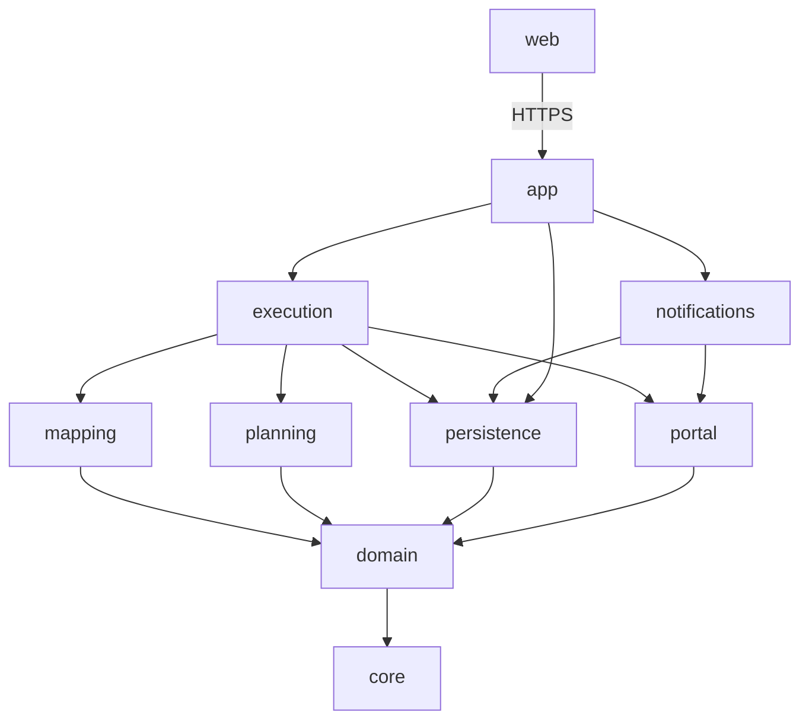

# MODULE BOUNDARIES

**Baseline:** `0290fe9…` · target design. **Arrow convention: `X → Y` = "X depends on / imports Y".**

---

## 1. Modules & responsibilities

| Module | Responsibility | May import | Must NOT import |
|---|---|---|---|
| `core` | config, clock, errors, `Money`(Decimal), base types | — | anything project-specific |
| `domain` | entities, value objects, normalization contracts (glass/labour/origin), mapping RULES, plan types. Pure, deterministic, **no I/O** | `core` | Playwright, sqlite3, FastAPI, network |
| `mapping` | Wexia typed input → domain (normalization boundary) | `domain`,`core` | Playwright, sqlite3, FastAPI |
| `planning` | workflow registry + deterministic plan builders → `ProposedPlan` (pure data) | `domain`,`core` | Playwright, sqlite3, FastAPI |
| `persistence` | SQLite WAL repositories, outbox, migrations. **Sole `sqlite3` owner** | `domain`,`core` | Playwright, FastAPI |
| `portal` | Playwright gateway: capabilities, context interception, session vault, identity gate, read/diff/verify ops. **Sole Playwright owner** | `domain`,`core` | **sqlite3, `persistence`**, FastAPI |
| `execution` | job runner, per-account lease use, applies a plan via `portal`, writes audit/outbox via `persistence` | `planning`,`portal`,`persistence`,`mapping`,`domain`,`core` | FastAPI |
| `notifications` | extraction + category-presence sync + poll runs | `portal`,`persistence`,`domain`,`core` | FastAPI |
| `app` | FastAPI: auth, RBAC, endpoints, SSE, DI wiring. **Sole FastAPI owner** | all below | — |
| `web` | static dashboard; talks to `app` over HTTPS only | (none — separate asset) | — |

**Nothing imports `app`.** No cycles.



## 2. Dependency rules (enforced by tests)
- `domain`, `mapping`, `planning` are **pure**: an import-linter contract test forbids importing `playwright`,
  `sqlite3`, `fastapi`, `httpx`, `requests`, or any network/browser library from these packages.
- Exactly one owner per external concern: `portal`→Playwright, `persistence`→sqlite3, `app`→FastAPI.
- Direction is one-way (inner never imports outer). A cycle fails the contract test.

## 3. AuthProvider boundary (decision #2)
Authentication is behind an `AuthProvider` interface in `app` (or a thin `auth` sub-package):
```text
AuthProvider.authenticate(username, secret) -> AuthenticatedUser | AuthError
AuthProvider.supports_password_change: bool
```
- Initial implementation: `LocalUserAuthProvider` (local `users` table, Argon2id — `API_CONTRACTS.md` §Auth).
- Future: `WindowsAdAuthProvider` can be added **without changing `domain`/`planning`/`execution`** — only the `app`
  wiring changes. Domain/workflow code never references a concrete auth mechanism. Roles/permissions remain the
  authorization primitive regardless of provider.

## 4. Capability ownership (summary; full detail in `SAFETY_MODEL.md`)
Only `portal` constructs BrowserContexts and capabilities (`LoginCapability`, `ReadCapability`,
`VerifiedMissionWriter`). No other module receives a raw context or a general write handle. `execution` orchestrates
by calling `portal`'s explicit methods; it cannot issue arbitrary portal requests.

**Lease ownership (correction #5):** `execution` acquires the per-account lease **through `persistence`** and passes the
resulting **`LeaseHandle`** into `portal`'s capability constructors. `portal` **does not import `persistence`/sqlite3**
and **does not reacquire** the lock — this removes the previous self-deadlock (writer acquiring a lease then opening a
reader that reacquires it). Row-write capability may be held only by the single service process (OS single-instance
mutex, `SAFETY_MODEL.md` §5).

**Plan/writer pairing lives in `execution` (correction #1):** `domain` defines only pure plan **data**
(`ProposedPlan`, `ApprovedPlanReference`, `ExecutablePlanData`) and never references a portal capability. The type that
pairs plan data with a live writer belongs here:
```text
# execution module (may depend on domain AND portal):
AuthorizedExecution { plan: ExecutablePlanData (domain), writer: VerifiedMissionWriter (portal) }
```
Only `execution` may construct an `AuthorizedExecution`, and only after the execution-authorization checks
(`API_CONTRACTS.md` §Jobs, `WORKFLOW_STATE_MODEL.md`). This keeps `domain` pure while confining the write pairing to the
one module allowed to depend on both sides.

## 5. Configuration
All environment/host/subnet/TLS/DPAPI/retention settings load through `core.config` as typed settings with
**fail-closed defaults** (e.g., an absent subnet allowlist does not disable auth; an unreadable TLS cert stops the
service). No security-relevant setting is a bare stringly-typed flag; see `SAFETY_MODEL.md` for the write-enable gate.
