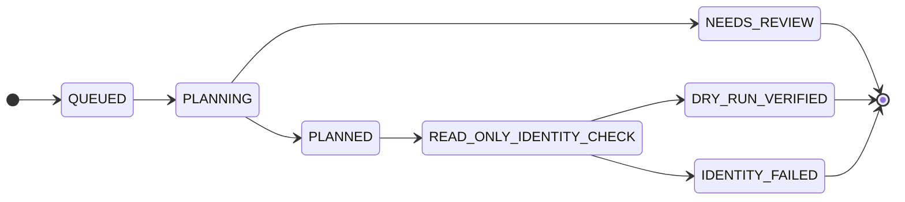
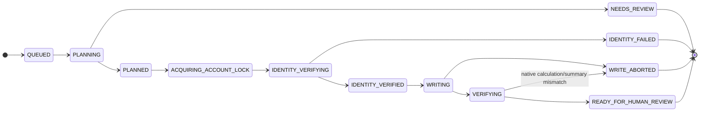

# WORKFLOW STATE MODEL

**Baseline:** `0290fe9…` · target design. Applies decisions #2 (separate DRY_RUN/EXECUTE), #5 (lease lifetime),
#8 (human finalization). Authoritative safety rules: `SAFETY_MODEL.md`.

---

## 1. Workflow registry
`WorkflowRegistry`: `name → { plan_builder, required_capabilities, allowed_row_ops }`. A plan builder is a **pure**
function `(typed input) -> ProposedPlan` (pure data — `DOMAIN_MODEL.md` §6). The registry declares which row-op contracts
a workflow may use; the writer enforces that set (nothing outside it can be issued).

## 2. Two job kinds, two terminal paths (no upgrade)
A DRY_RUN can never become a write. An EXECUTE job is **separately authorized**, references the approved DRY_RUN
(`parent_job_id`) and **re-checks `input_hash` + `plan_hash`** before writing (mismatch → fail closed `INPUT_CHANGED`).

### DRY_RUN (ReadCapability only)

No `VerifiedMissionWriter` is ever constructed for a DRY_RUN — the write path does not exist for it.

### EXECUTE (VerifiedMissionWriter; lease held only across the write window)

**`READY_FOR_HUMAN_REVIEW` is the TERMINAL automation state** (correction #2). The automation job never transitions to a
"human-completed" status. `FINALIZED_BY_HUMAN` is modelled **outside** the automation job — see §6.

**Plans are pure data; pairing happens in execution (corrections #1/#3):** PLANNING produces a `ProposedPlan` (pure data,
no `mode`/`read_only`). EXECUTE authorization forms an `ApprovedPlanReference` and, only after re-deriving steps from the
retained input (`DATA_MODEL.md` §4a) and matching `plan_hash`/`input_hash`, an `ExecutablePlanData` (still pure data). The
`execution` module then pairs it with a live writer as `AuthorizedExecution` (`MODULE_BOUNDARIES.md` §4) — `domain` never
references a portal capability. The `mode` (DRY_RUN|EXECUTE) lives on `AutomationJob`; no field inside a plan can unlock writes.

**Repair-workflow agreement (structural context, not authorization):** `repair_workflow`
(`MODE_NORMAL` | `GARAGE_CONVENTIONNE`) is typed plan data, included in the canonical serialization and `plan_hash`.
A parent DRY_RUN and its EXECUTE job must reference the **same** `repair_workflow` — a mismatch is rejected at execution
authorization. Before any write, the **observed portal repair workflow must equal `ExecutablePlanData.repair_workflow`**;
a mismatch **fails closed before the first mutation**. `repair_workflow` is **not** execution authorization — only the
separate EXECUTE authorization (`ApprovedPlanReference` → `ExecutablePlanData` → `AuthorizedExecution`) unlocks writes.

## 3. Lease lifetime (decision #5)
- **PLANNING is pure and holds no lease** (no portal, no session).
- The **per-account lease** (`account_leases`, `DATA_MODEL.md`) is acquired at `ACQUIRING_ACCOUNT_LOCK` and held
  **only** through IDENTITY_VERIFYING → WRITING → VERIFYING.
- **Released on entry to `READY_FOR_HUMAN_REVIEW`.** A human delay never blocks notifications, session refresh, or
  other accounts. `heartbeat_at` is renewed while held; a dead holder's lease auto-expires.
- **LeaseHandle ownership (correction #5):** `execution` acquires the lease **through `persistence`** and receives a
  `LeaseHandle`, which it **passes to `portal`**. `portal` never reacquires the lock and never imports sqlite/persistence.
- **Heartbeat-loss response (correction #5):** the writer validates the `fencing_token`/handle **immediately before every
  portal write**; if the heartbeat is lost or ownership was replaced, the writer **immediately aborts routing, closes the
  write BrowserContext, and prevents any further requests** → `WRITE_ABORTED`. (Note the fencing caveat in
  `SAFETY_MODEL.md` §5 / `DATA_MODEL.md` §5: SinAuto does not validate the token, so an OS single-instance mutex is the
  real single-writer guarantee.)

## 4. Row-op lifecycle inside WRITING (RBW / DBW / VAW)
For each `RowOp`:
1. **read-before-write** (Read op): read the current row state.
2. **diff-before-write:** if current == intended, **skip** (idempotent; no write).
3. **fencing check** (§3) then **write** via the writer's explicit `add_normal_row` or `edit_conventionne_row` (allowlisted contract only).
4. **verify-after-write** (Read op): re-read; must equal intended.
5. **atomic commit:** `automation_jobs` transition + `audit_events` + `event_outbox` in one SQLite transaction.
Any mismatch at step 4, or a lost fence at step 3 → stop, `WRITE_ABORTED`, no further writes.

After all row writes and read-backs succeed, the workflow transitions **WRITING → VERIFYING**.
In **VERIFYING**, the agent must trigger the workflow-specific native financial calculation and read/verify the resulting financial summary (charge mutuelle, charge sociétaire, TTC, TVA, etc. — the agent never writes these fields; `docs/architecture/PORTAL_ROW_WORKFLOWS.md` §3). The outcome is **deterministic — no operator- or config-dependent choice**:

- **VERIFYING → READY_FOR_HUMAN_REVIEW** only when the native calculation **and** the exact financial-summary verification both succeed.
- **VERIFYING → WRITE_ABORTED** when the native calculation fails, is stale, or is missing, or when the financial summary mismatches the verified expectation. This is a normal-runtime failure outcome; no further writes occur.
- **`INTERRUPTED_NEEDS_HUMAN_REVIEW` is reached only through crash/restart reconciliation** (§7): a crash/restart while the stored status is `VERIFYING` becomes `INTERRUPTED_NEEDS_HUMAN_REVIEW` and is **never automatically resumed**. A live, uninterrupted run never enters that state from `VERIFYING`.

## 5. TOCTOU (decision #2)
Identity is verified when the writer opens the mission **and re-verified immediately before the first write and after
any navigation/redraw**, so a stale page cannot cause a write against the wrong mission.

## 6. Human finalization (decision #8, corrections #2 and #7-F12)
- **`READY_FOR_HUMAN_REVIEW` is the terminal automation result.** The automation produces a readiness/diff report
  (planned vs verified read-back per row). The agent **never** invokes Enregistrer, Valider, Clôturer, GED, or any
  final endpoint (permanently blocked, `SAFETY_MODEL.md`).
- **`FINALIZED_BY_HUMAN` is a separately observed claim/business event** with its **own evidence source and timestamp**
  (`observed_finalizations`, `DATA_MODEL.md` §3): it is recorded only when a subsequent read/scrape shows the mission
  validated in the portal. It **must not** mutate `automation_jobs` into a human-completed automation status.
- No `page.pause()` and no lease held while waiting for the human.
- **Truthful state (correction #7, F12):** "Verified", "READY", "Prêt" must reflect a **real check** — an actual DOM/state
  comparison or a completed verification — **never** file existence, a `finally` block, or an unconditional print. A
  readiness label is set only after the corresponding check passes; a failed check yields a failure state, not "ready".

## 7. Durable enqueue, atomic transitions, crash recovery (correction #5)
- **Atomic enqueue:** job creation writes `automation_jobs` (status `QUEUED`) + encrypted `job_inputs` +
  `account_state_version` bump + `event_outbox` event in **one transaction** — all-or-nothing (no input-less or
  half-created job). Valid statuses are constrained by a CHECK (`DATA_MODEL.md` §4).
- **Atomic transitions:** each transition writes the job row + its outbox event in **one transaction**; `state_version`
  = the account's monotonic version at that transition.
- **Restart reconciliation** (before serving), by status — **fully deterministic, no operator- or config-dependent
  choice; every non-terminal status has an explicit outcome:**
  - `{QUEUED, PLANNING, PLANNED}` **and `READ_ONLY_IDENTITY_CHECK`** (DRY_RUN, read-only, no writes) → **verify the
    retained `job_inputs`** (present, unexpired, decryptable, `content_hash` matches `input_hash`) → **return the job to
    `QUEUED`** → **deterministically re-plan from the beginning**. Planning is pure and no portal state was touched, so
    this is always safe. If the input is **missing, expired, undecryptable, or hash-mismatched** → **`ERROR`** with the
    fail-closed reason (`MISSING_JOB_INPUT` / `INPUT_EXPIRED` / `INPUT_UNDECRYPTABLE` / `INPUT_HASH_MISMATCH`). Never
    executed on a guessed input.
  - `{ACQUIRING_ACCOUNT_LOCK, IDENTITY_VERIFYING, IDENTITY_VERIFIED}` — all **pre-write** (no row write has occurred yet,
    even in `IDENTITY_VERIFIED`, which is the step immediately before `WRITING`) → **`ABORTED_ON_RESTART`; release the
    lease**. Neither state performs nor resumes a write.
  - `{WRITING, VERIFYING}` (writes possibly partial) → `INTERRUPTED_NEEDS_HUMAN_REVIEW` with a diff report; **never
    automatically resumed or replayed.**
  - terminal / `READY_FOR_HUMAN_REVIEW` / `DRY_RUN_VERIFIED` → kept (lease already released).
  - stale `account_leases` (`expires_at < now`) → released first.

  **Coverage:** these branches cover every value in the `automation_jobs` status CHECK (`DATA_MODEL.md` §4); no
  non-terminal status is left without a deterministic, fail-closed restart outcome.
- **Idempotency:** `(account_id, idempotency_key)` returns the existing job (incl. failed — not silently re-run); a real
  retry needs a new key + explicit authorization.
