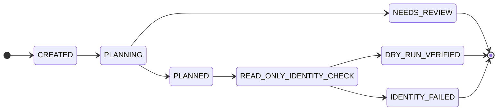
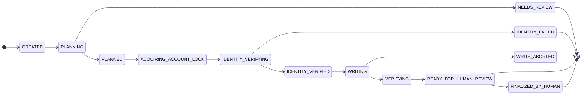

# WORKFLOW STATE MODEL

**Baseline:** `0290fe9…` · target design. Applies decisions #2 (separate DRY_RUN/EXECUTE), #5 (lease lifetime),
#8 (human finalization). Authoritative safety rules: `SAFETY_MODEL.md`.

---

## 1. Workflow registry
`WorkflowRegistry`: `name → { plan_builder, required_capabilities, allowed_row_ops }`. A plan builder is a **pure**
function `(typed input) -> ExecutionPlan`. The registry declares which row-op contracts a workflow may use; the writer
enforces that set (nothing outside it can be issued).

## 2. Two job kinds, two terminal paths (no upgrade)
A DRY_RUN can never become a write. An EXECUTE job is **separately authorized**, references the approved DRY_RUN
(`parent_job_id`) and **re-checks `input_hash` + `plan_hash`** before writing (mismatch → fail closed `INPUT_CHANGED`).

### DRY_RUN (ReadCapability only)

No `VerifiedMissionWriter` is ever constructed for a DRY_RUN — the write path does not exist for it.

### EXECUTE (VerifiedMissionWriter; lease held only across the write window)

## 3. Lease lifetime (decision #5)
- **PLANNING is pure and holds no lease** (no portal, no session).
- The **per-account lease** (`account_leases`, `DATA_MODEL.md`) is acquired at `ACQUIRING_ACCOUNT_LOCK` and held
  **only** through IDENTITY_VERIFYING → WRITING → VERIFYING.
- **Released on entry to `READY_FOR_HUMAN_REVIEW`.** A human delay never blocks notifications, session refresh, or
  other accounts. `heartbeat_at` is renewed while held; a dead holder's lease auto-expires.
- **Fencing:** the writer checks the `fencing_token` is still current **immediately before every portal write**;
  expired or replaced ownership → **abort** → `WRITE_ABORTED` (no further writes).

## 4. Row-op lifecycle inside WRITING (RBW / DBW / VAW)
For each `RowOp`:
1. **read-before-write** (Read op): read the current row state.
2. **diff-before-write:** if current == intended, **skip** (idempotent; no write).
3. **fencing check** (§3) then **write** via the writer's explicit `write_row` (allowlisted contract only).
4. **verify-after-write** (Read op): re-read; must equal intended.
5. **atomic commit:** `automation_jobs` transition + `audit_events` + `event_outbox` in one SQLite transaction.
Any mismatch at step 4, or a lost fence at step 3 → stop, `WRITE_ABORTED`, no further writes.

## 5. TOCTOU (decision #2)
Identity is verified when the writer opens the mission **and re-verified immediately before the first write and after
any navigation/redraw**, so a stale page cannot cause a write against the wrong mission.

## 6. Human finalization (decision #8)
- **`READY_FOR_HUMAN_REVIEW` is the terminal automation result.** The automation produces a readiness/diff report
  (planned vs verified read-back per row). The agent **never** invokes Enregistrer, Valider, Clôturer, GED, or any
  final endpoint (permanently blocked, `SAFETY_MODEL.md`).
- **`FINALIZED_BY_HUMAN` is a separately observed business event**, recorded only on evidence (e.g., a later read shows
  the mission validated). It is **not** an automation success transition and is never auto-set.
- No `page.pause()` and no lease held while waiting for the human.

## 7. Atomic transitions, versions, crash recovery
- Each transition writes the job row + its outbox event in **one transaction**; `state_version` = the account's
  monotonic version at that transition.
- **Restart reconciliation** (before serving): expire stale leases; `{PLANNING,PLANNED}` and
  `{ACQUIRING_ACCOUNT_LOCK,IDENTITY_VERIFYING}` → `ABORTED_ON_RESTART`; `{WRITING,VERIFYING}` →
  `INTERRUPTED_NEEDS_HUMAN_REVIEW` with a diff report and **never** auto-resumed; terminal/READY states kept.
- **Idempotency:** `(account_id, idempotency_key)` returns the existing job (incl. failed — not silently re-run); a real
  retry needs a new key + explicit authorization.
