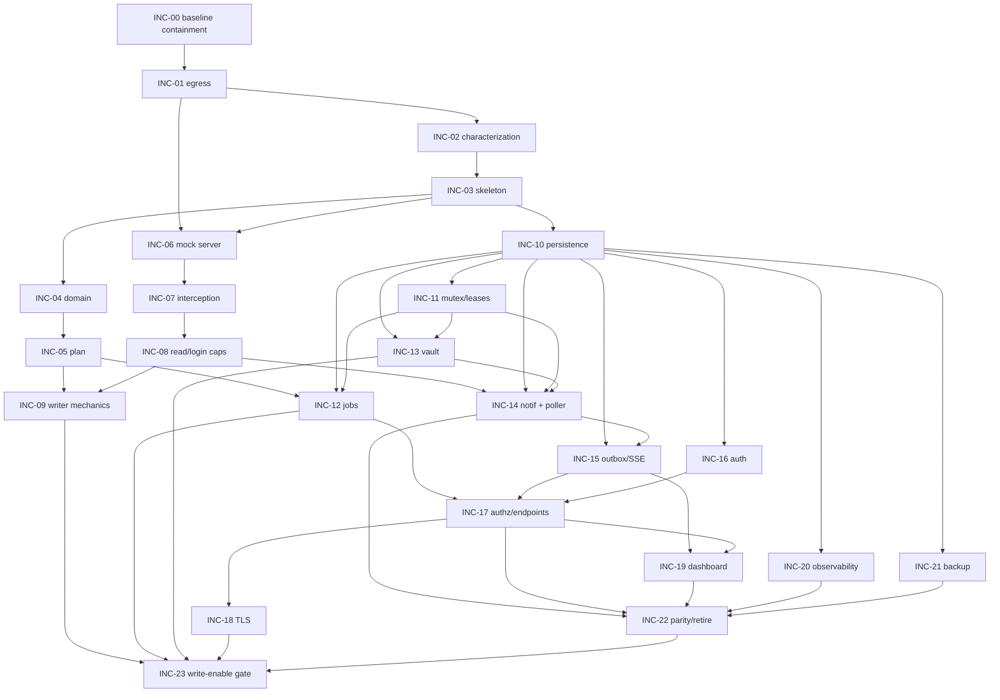

# Rebuild Roadmap — increments, order, dependencies, critical path

Baseline `0290fe9` · target per `docs/architecture/*`. Order follows **ADR-0010 (safety-first)**; deviations are noted
with justification. Each increment has limited blast radius and an independent offline verification.

## Increment list (execution order)

| ID | Title | Phase | Primary INV / F / ADR | Enables live write? |
|---|---|---|---|---|
| INC-00 | **Baseline live-write containment** (disable baseline write/LAN exposure for the rebuild) | 0 Test-safety | INV-1/2/3/8/11 (interim); F6/F8/F18 | no (removes baseline write) |
| INC-01 | Test egress lockdown (OS/CI + pre-collection + pytest-socket + proof) | 0 Test-safety | F(test-gap); ADR-0010 | no |
| INC-02 | Characterization tests for working baseline behavior | 0 Test-safety | preserve features; ADR-0010 | no |
| INC-03 | Project config + module skeleton + import-linter dependency contract | 1 Domain | ADR-0001; MODULE_BOUNDARIES; F28 | no |
| INC-04 | Pure domain: value objects, enums, normalization, Money, business rules | 1 Domain | INV-6/7; F13/14/15/17/33; ADR-0002 | no |
| INC-05 | Typed Wexia input boundary → deterministic `ProposedPlan` | 1 Domain | INV-6/7; F11; ADR-0002 | no |
| INC-06 | Extended mock server + portal-contract fixtures | 2 Portal-safety | PORTAL_CONTRACT; ADR-0004 | no |
| INC-07 | Context-level default-deny interception + permanent final block | 2 Portal-safety | INV-3/4; F8/F9; ADR-0004 | no |
| INC-08 | `ReadCapability` + `LoginCapability` (LeaseHandle; write-enable OFF) | 2 Portal-safety | INV-1; ADR-0003 | no |
| INC-09 | Mission search + identity gate + TOCTOU + exact-IdRubrique + `VerifiedMissionWriter` mechanics | 2 Portal-safety | INV-2/6/8; F3/4/5/6/7/16; ADR-0003 | **no (gated)** |
| INC-10 | SQLite WAL + migration framework + repositories | 3 Persistence | ADR-0005/0006; F26 | no |
| INC-11 | OS single-instance mutex + account leases + heartbeat-loss | 3 Persistence | ADR-0007; correction #5 | no |
| INC-12 | Durable job model: atomic enqueue, DRY_RUN/EXECUTE state machines, restart reconciliation | 3 Persistence | ADR-0002/0005; F25 | no |
| INC-13 | Multi-account session vault: DPAPI handoff, rotation, revocation, fail-closed | 3 Persistence | ADR-0007; INV-10; F21/F23/F24 | no |
| INC-14 | Notification extraction + category-scoped three-poll lifecycle | 4 Notif/Events | ADR-0006; INV-9; F27(read) | no |
| INC-15 | Transactional outbox + state versions + SSE (global cursor, retention, resync) | 4 Notif/Events | ADR-0009 | no |
| INC-16 | Local auth (Argon2id, AuthProvider), sessions, CSRF, permissions, secure bootstrap | 5 API/Auth | INV-11; ADR-0008; F18/F24 | no |
| INC-17 | Per-account authorization + server-derived audit + typed errors + endpoints | 5 API/Auth | INV-11; ADR-0008; F19/F20 | no |
| INC-18 | TLS-only LAN deployment + internal CA + cert operations | 5 API/Auth | INV-11; ADR-0008 | no |
| INC-19 | Dashboard migration: XSS removal, truthful readiness, no demo-as-real | 6 Dashboard/Ops | INV-10; F12/F22/F27 | no |
| INC-20 | Structured logging + PII redaction + screenshot retention + audit + real health | 6 Dashboard/Ops | INV-10; F21/F29/F32 | no |
| INC-21 | Backup/restore + BitLocker/ACL verification + SQLCipher fallback gate | 6 Dashboard/Ops | INV-10; ADR-0005; DATA_MODEL §9 | no |
| INC-22 | Feature-parity verification + retire obsolete baseline paths | 7 Cutover | preserve features; F28/F30 | no |
| INC-23 | Endpoint-contract confirmation + **write-enable gate** + canary cutover | 7 Cutover | ADR-0004 A5; INV-1..8 | **yes (final gate)** |

## Dependency graph (arrow = "must land before")

## Canonical dependency table (single source of truth — correction #2)
Every increment's `Prerequisites` field, the Mermaid graph below, and `TRACEABILITY_BACKLOG.md` are all derived from
this one table. **Consistency rule:** the graph has an edge `X → Y` **iff** `X ∈ prerequisites(Y)` in this table, and
each increment file's `Prerequisites` must match its row here exactly. A drift check (below) makes this reproducible.

| Increment | Prerequisites |
|---|---|
| INC-00 | — |
| INC-01 | INC-00 |
| INC-02 | INC-01 |
| INC-03 | INC-02 |
| INC-04 | INC-03 |
| INC-05 | INC-04 |
| INC-06 | INC-01, INC-03 |
| INC-07 | INC-06 |
| INC-08 | INC-07 |
| INC-09 | INC-05, INC-08 |
| INC-10 | INC-03 |
| INC-11 | INC-10 |
| INC-12 | INC-05, INC-10, INC-11 |
| INC-13 | INC-10, INC-11 |
| INC-14 | INC-08, INC-10, INC-11, INC-13 |
| INC-15 | INC-10, INC-14 |
| INC-16 | INC-10 |
| INC-17 | INC-12, INC-15, INC-16 |
| INC-18 | INC-17 |
| INC-19 | INC-15, INC-17 |
| INC-20 | INC-10 |
| INC-21 | INC-10 |
| INC-22 | INC-14, INC-17, INC-19, INC-20, INC-21 |
| INC-23 | INC-09, INC-12, INC-13, INC-18, INC-22 |

**Drift check (reproducible):** a plan-lint step parses each `Prerequisites:` line from `increments/*.md`, compares the
set to this table, and compares both to the graph edges below; any mismatch fails. (Planned as `tests/plan/test_roadmap_prereqs_match_graph.py` in INC-03's plan-contract tests — see INC-03.)

## Critical path (recomputed from the corrected graph)
The longest path (13 increments) runs through the notifications → SSE → API → dashboard → cutover chain and converges at
INC-23:

`INC-00 → INC-01 → INC-02 → INC-03 → INC-06 → INC-07 → INC-08 → INC-14 → INC-15 → INC-17 → INC-19 → INC-22 → INC-23`

There are several equal-length (13-node) longest paths (e.g., substituting the persistence chain
`INC-10 → INC-11 → INC-13 → INC-14` for `INC-06 → INC-07 → INC-08 → INC-14`, since INC-14 depends on both INC-08 and
INC-13). **INC-09, INC-12 and INC-13 are parallel branches with no direct edges between them** (the earlier
`INC-09 → INC-12 → INC-13` linear claim was wrong and is removed); they reconverge only at **INC-23**, the sole
live-write gate, reachable after endpoint-contract confirmation. INC-00 precedes everything.

## Phase gates (must pass before the next phase begins)
- **Gate 0 (after INC-01):** the proof test shows a subprocess and a headless Chromium cannot reach the production host.
  No browser code merges before this passes. (RELEASE_GATES G0.)
- **Gate 1 (after INC-05):** domain + planning are pure (import-linter green), deterministic (`plan_hash` stable), and
  fail-closed on every unknown/ambiguous case; the repair workflow is typed (`RepairWorkflow`) and included in plan
  hashing, and both deterministic builders/registry entries are test-covered
  (`docs/architecture/PORTAL_ROW_WORKFLOWS.md`). (G1.)
- **Gate 2 (after INC-09):** dry-run cannot construct a writer; final endpoints abort; unknown requests fail closed;
  identity mismatch/zero/multiple fail closed; exact-IdRubrique enforced; charge-mutuelle never directly written; the
  exact Mode Normal and PEC workflow lifecycles pass against the mock; the observed workflow must agree with the
  executable plan (mismatch fails closed); native financial verification is mandatory and a failed/stale calculation
  prevents readiness; final dossier actions blocked — all proven against the mock server, **live writes still
  disabled**. (G2.)
- **Gate 3 (after INC-13):** durable jobs survive crash-recovery deterministically; leases + OS mutex enforce single
  writer; vault fails closed on decrypt/binding failure. (G3.)
- **Gate 4 (after INC-18):** TLS-only; authenticated, per-account-authorized API; server-derived audit. (G4.)
- **Gate 5 (INC-23):** endpoint-contract confirmed against approved evidence — including the exact Mode Normal native
  trigger + summary-verification contract (currently UNCONFIRMED, `docs/architecture/PORTAL_ROW_WORKFLOWS.md` §3.1) and
  the exact PEC row/native contracts. **A `VerifiedMissionWriter` can be constructed only when valid, approved
  `confirmed_row_ops` records exist for the exact deployed commit and every G5 requirement passes** — live-write
  authorization is data-driven, not a flip/boolean/flag. Performed only under the supervised canary procedure with human
  final validation still mandatory. (G5 — the live-write gate.)

## Deviations from ADR-0010 (with justification)
ADR-0010's ordered list is followed. Two clarifications, not deviations:
- Persistence (INC-10) is placed **after** the portal-safety mechanics (INC-06..09) because those mechanics are unit/
  safety-tested in-memory against the mock server and do not require the DB; this keeps the safety core reviewable before
  introducing schema. Job **persistence** (INC-12) still precedes any live write.
- The single "auth/RBAC + TLS" ADR-0010 step is split into INC-16/17/18 for limited blast radius (auth core → authz +
  endpoints → TLS/PKI), per the "no large migration in one vague increment" rule.
